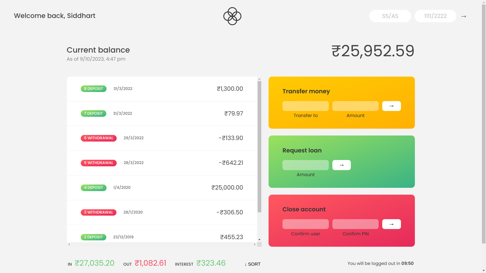

# ATM-App

## Description

This is the online banking section of [Banking Project](https://github.com/siddhart-singh/Bankist-Landing-Page).
This project simulates an online banking portal where you can transfer money, request for loans or delete your account.

## How to run the Project

Project is live at (*THIS LINK*)[https://siddhart-singh.github.io/ATM-App/]

## How to use the Project

1. Click the link above.
2. Upon loading it'll ask for username and password.
3. Use one of these\
Username/Password = SS/1111 or AS/2222
4. Enter other username in transfer money section to transfer the money.
5. Request loan through request loan section.
6. Delete account through close account section.
7. Sort transactions by the time throught sort button at bottom to the right of interest.

## Technology

1. HTML, CSS
2. JavaScript
3. Linux
4. [Git](https://git-scm.com/)
5. [Ion Icons](https://ionic.io/ionicons)
6. [Icons8](https://icons8.com/)
7. [Google Fonts](https://fonts.google.com/)
